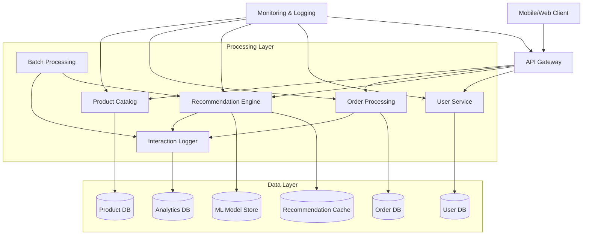
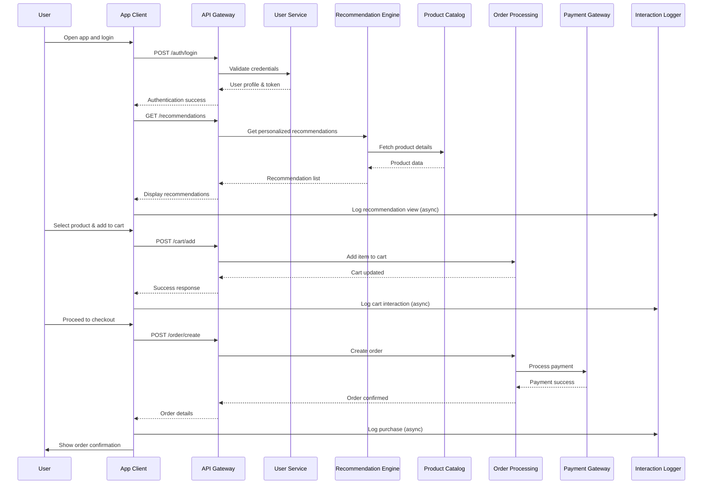

# GOLD App System Design Summary

## 1. Understanding GOLD App Workings

Based on the App Store page description, GOLD is a mobile shopping application focused on daily deals and personalized shopping experiences. The app operates as follows:

### Core Functions:
- **Daily "Golden Hour" Discounts**: Users receive time-limited offers on various products during specific "golden hour" windows each day
- **Personalized Recommendations**: AI-driven system that learns user preferences through browsing and purchase history to suggest relevant products
- **AI Learning User Preferences**: Machine learning algorithms analyze user behavior patterns, purchase history, and interaction data to improve recommendation accuracy over time
- **Free Shipping**: No delivery costs for all orders, regardless of order value
- **No Subscription Fees**: Completely free to use without any premium tiers or recurring charges

### User Flow:
1. User opens app and browses available deals
2. App displays personalized recommendations based on user profile and behavior
3. User selects products and adds them to cart during golden hour for best deals
4. Seamless checkout process with free shipping
5. Order tracking and delivery updates

### Technical Characteristics:
- Mobile-first design optimized for iOS/Android
- Real-time deal availability and countdown timers
- Offline browsing capabilities for deal previews
- Push notifications for golden hour alerts and personalized offers
- Integration with payment processors for secure transactions

## 2. Predicted System Design Interview Question

**Question**: Design a high-level architecture for a personalized recommendation system for an e-commerce platform like GOLD, emphasizing scalability for millions of users, real-time recommendation serving, and A/B testing capabilities. Consider class structures, tradeoffs between consistency and availability, horizontal scaling approaches, concurrency handling, and caching strategies.

This question aligns with Sage AI Labs' focus on AI-driven personalization, A/B testing platforms, and scalable e-commerce systems.

## 3. Design Solution Using 3-Step Framework

### Step 1: Requirements Analysis

#### Functional Requirements:
- Generate personalized product recommendations based on user behavior, preferences, and purchase history
- Support A/B testing for recommendation algorithms and UI variations
- Real-time recommendation serving with sub-second latency
- Handle user profile management and preference learning
- Process high-volume product catalog and user interaction data
- Support multiple recommendation algorithms (collaborative filtering, content-based, hybrid)

#### Non-Functional Requirements:
- **Scalability**: Support 10M+ daily active users and 100M+ products
- **Performance**: <500ms recommendation response time, 99.9% uptime
- **Availability**: High availability with minimal downtime for maintenance
- **Data Consistency**: Eventual consistency for user preferences, strong consistency for transactions
- **Security**: User data privacy, secure API access
- **Cost Efficiency**: Optimize infrastructure costs while maintaining performance

#### Key Constraints:
- Real-time processing of user interactions
- Integration with existing e-commerce platform
- A/B testing without affecting production performance

### Step 2: Data/API/Scale Estimation

#### Data Volume:
- **Users**: 10M active users, 50M total registered
- **Products**: 100M+ products with metadata, images, pricing
- **Interactions**: 1B+ daily user-product interactions (views, clicks, purchases)
- **Storage**: 10TB+ for user profiles, interaction logs, product catalog

#### API Endpoints:
- `POST /api/v1/recommendations` - Get personalized recommendations
- `POST /api/v1/user/profile` - Update user preferences
- `GET /api/v1/products/{id}` - Product details
- `POST /api/v1/ab-test/variant` - A/B test assignment
- `POST /api/v1/interactions` - Log user interactions

#### Scale Numbers:
- **Read QPS**: 100K recommendations/second during peak hours
- **Write QPS**: 50K interaction logs/second
- **Data Growth**: 20% monthly increase in users and products
- **Storage Growth**: 5TB/month for interaction logs

### Step 3: Design Solution

#### Class Structure:
```python
class UserService:
    def get_user_profile(self, user_id: str) -> UserProfile
    def update_preferences(self, user_id: str, preferences: dict) -> bool
    def get_user_segment(self, user_id: str) -> str

class RecommendationEngine:
    def generate_recommendations(self, user_id: str, context: RecommendationContext) -> List[Product]
    def train_model(self, training_data: DataFrame) -> Model
    def ab_test_variant(self, user_id: str, experiment_id: str) -> str

class ProductCatalog:
    def get_product(self, product_id: str) -> Product
    def search_products(self, query: str, filters: dict) -> List[Product]
    def get_similar_products(self, product_id: str) -> List[Product]

class InteractionLogger:
    def log_interaction(self, interaction: UserInteraction) -> bool
    def get_user_history(self, user_id: str, limit: int) -> List[Interaction]

class CacheManager:
    def get_cached_recommendations(self, user_id: str) -> List[Product]
    def cache_recommendations(self, user_id: str, recommendations: List[Product]) -> bool
    def invalidate_user_cache(self, user_id: str) -> bool
```

#### Tradeoffs Analysis:
- **Consistency vs. Availability**: Use eventual consistency for user preferences (acceptable for recommendations), strong consistency for order transactions
- **Performance vs. Cost**: Implement intelligent caching to reduce compute costs, use spot instances for batch training
- **Accuracy vs. Latency**: Pre-compute recommendations for popular users, use approximate nearest neighbors for real-time queries
- **Complexity vs. Maintainability**: Microservices architecture increases complexity but improves scalability and team autonomy

#### Scalability:
- **Horizontal Scaling**: Stateless microservices deployed across multiple zones
- **Database Sharding**: User data sharded by user_id, product data by category
- **Load Balancing**: API Gateway with intelligent routing based on user location and load
- **Auto-scaling**: Kubernetes HPA based on CPU/memory and custom metrics
- **CDN**: Static assets and cached recommendations served via CloudFront

#### Concurrency:
- **Queue-based Processing**: Kafka queues for interaction logging and model training
- **Optimistic Locking**: For user preference updates to handle concurrent modifications
- **Connection Pooling**: Database connection pools with retry logic
- **Async Processing**: Non-blocking I/O for API responses, background processing for model updates

#### Caching Strategy:
- **Redis Cluster**: User sessions (TTL: 24h), hot recommendations (TTL: 1h)
- **CDN**: Product images and metadata (TTL: 24h)
- **Application Cache**: Frequently accessed product catalog in-memory
- **Cache Invalidation**: Event-driven invalidation on user preference changes
- **Cache Warming**: Pre-populate cache for high-value users during off-peak hours

## 4. Detailed Design Output

### Main Modules

#### User Service
**Responsibilities**:
- Manages user profiles, authentication, and authorization
- Tracks user preferences and behavior patterns
- Handles user segmentation for personalized experiences
- Integrates with identity providers and session management

#### Recommendation Engine
**Responsibilities**:
- Core AI/ML component for generating personalized recommendations
- Supports multiple algorithms (collaborative filtering, content-based, deep learning)
- Manages A/B testing frameworks and experiment tracking
- Handles model training, evaluation, and deployment pipelines

#### Order Processing
**Responsibilities**:
- Manages shopping cart operations and checkout flow
- Processes payments and integrates with payment gateways
- Handles order fulfillment and inventory management
- Provides order tracking and delivery status updates

#### Product Catalog
**Responsibilities**:
- Maintains comprehensive product database with metadata
- Supports product search, filtering, and categorization
- Manages product pricing, availability, and promotions
- Provides product recommendation features and similarity matching

#### Interaction Logger
**Responsibilities**:
- Captures and stores all user-product interactions
- Provides real-time and batch data access for analytics
- Supports data export for model training and business intelligence
- Ensures data privacy and compliance with retention policies

#### API Gateway
**Responsibilities**:
- Single entry point for all client requests
- Handles authentication, rate limiting, and request routing
- Provides API versioning and backward compatibility
- Implements security policies and monitoring

### Mermaid Architecture Diagram



**Explanation**:
- **Client Layer**: Mobile and web applications interact through the API Gateway
- **Processing Layer**: Core business logic distributed across microservices
- **Data Layer**: Various databases and caches optimized for specific data types
- **Data Flow**: User requests flow through API Gateway to appropriate services, with data persisted across multiple stores
- **Async Processing**: Batch jobs handle model training and analytics separately
- **Monitoring**: Centralized observability across all components

### Mermaid Sequence Diagram



**Explanation**:
- **Authentication Flow**: User logs in through User Service
- **Recommendation Flow**: Real-time personalized recommendations fetched and logged
- **Purchase Flow**: Complete end-to-end checkout with payment processing
- **Async Logging**: All user interactions logged asynchronously for performance
- **Error Handling**: Not shown but would include rollback mechanisms for failed payments
- **Caching**: Recommendations likely cached at API Gateway or service level for performance
