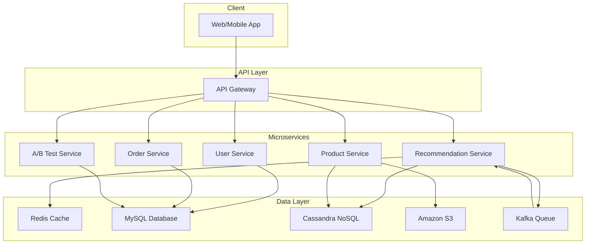
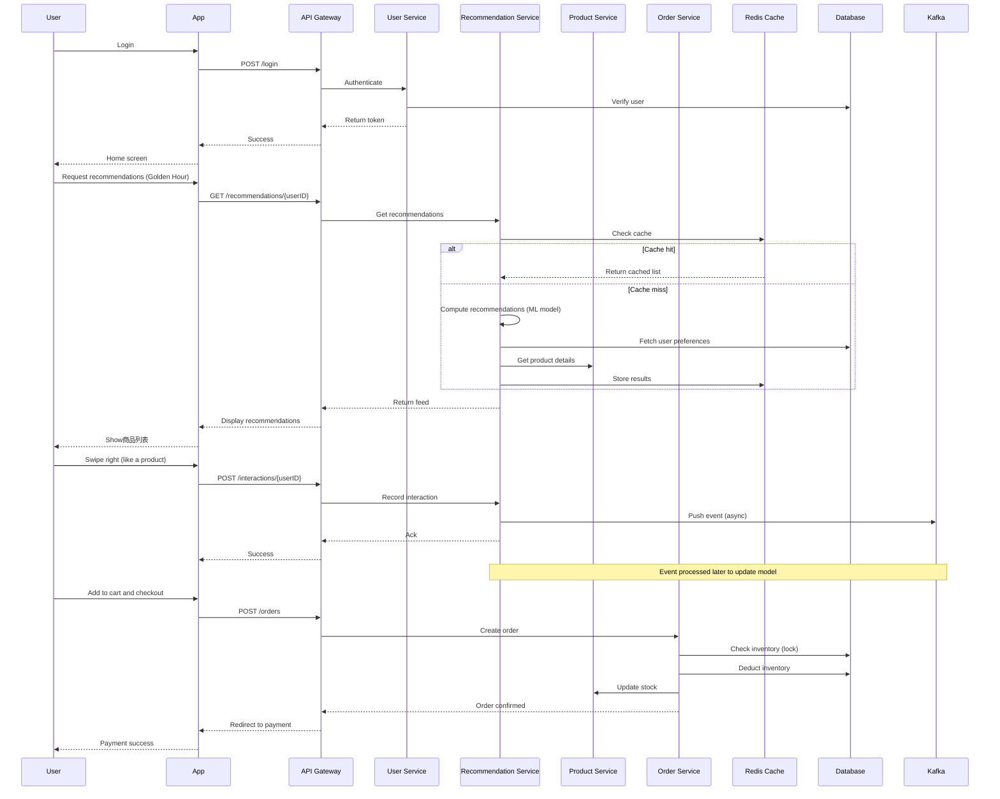
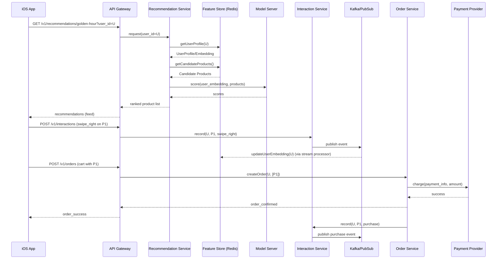

**背景信息：**
- **链接1**: https://apps.apple.com/us/app/gold-the-best-deals-daily/id6445965976 (这是一个XML格式的App Store页面，描述了GOLD应用的功能、用户评价、更新日志等细节)。
- **链接2**: https://jobs.ashbyhq.com/sagelabs.ai/67203763-323c-4ab2-bccb-efee374be78e(这是Sage AI Labs的招聘职位描述，强调AI驱动的个性化推荐系统、A/B测试平台等)。
- **链接3**: https://interviewing.io/guides/system-design-interview/part-three#about-this-3-step-framework (这是一个系统设计面试框架，详细介绍了需求分析、数据建模和设计步骤)。

**我的目标：**  
我正在面试Sage AI Labs公司（开发GOLD应用的公司），申请的是链接2中的AI Engineer岗位。系统设计轮面试要求是：“System Design (1 hour): Design high-level Architecture of systems emphasizing class structure, tradeoffs, scalability, concurrency, and caching—This will be a whiteboard session”。

**请求：**  
基于以上信息，请帮我完成以下任务：

1. **理解GOLD应用的工作原理**：根据链接1（App Store页面），详细总结GOLD应用是如何工作的。包括核心功能（如每日“Golden Hour”折扣、个性化推荐、AI学习用户偏好等）、用户流程、以及技术特点（如免费送货、无订阅费）。
   
2. **预测系统设计面试问题**：结合公司背景（Sage AI Labs专注于AI驱动的购物应用）和岗位要求（链接2），预测一个最有可能被问到的系统设计面试问题。问题应围绕GOLD应用的核心业务，例如设计一个个性化推荐系统或高并发交易平台。

3. **提供设计方案**：使用链接3中的3步框架（需求分析、数据/API/规模、设计）来回答预测的面试问题。设计方案必须全面符合公司背景（AI优先、电商规模）和工作描述（强调个性化、A/B测试、可扩展性）。方案需包括：
   - **类结构**（主要模块的职责和关系）。
   - **权衡分析**（如一致性vs.可用性、性能vs.成本）。
   - **可扩展性**（如何处理高并发、数据增长）。
   - **并发性**（如锁机制、队列使用）。
   - **缓存策略**（如Redis应用场景）。

4. **输出设计方案的详细内容**：对上述设计方案，提供：
   - **主要模块**：列出核心组件（如用户服务、推荐引擎、订单处理），并描述每个模块的职责。
   - **Mermaid架构图**：绘制一个高层架构图（使用Mermaid语法），展示模块间的交互和数据流，并解释图表。
   - **Mermaid序列图**：绘制一个序列图（使用Mermaid语法），以用户完成一次购买为例，展示端到端流程（如用户登录、接收推荐、下单、支付）。

基于您提供的背景信息，我将帮助您准备Sage AI Labs的AI Engineer岗位系统设计面试。首先，我会总结GOLD应用的工作原理，然后预测一个最可能的系统设计面试问题，并使用链接3中的3步框架提供详细的设计方案。最后，我会输出设计方案的详细内容，包括主要模块、Mermaid架构图和序列图。

### 1. 理解GOLD应用的工作原理（基于链接1：App Store页面）
GOLD是一个AI驱动的购物应用，核心目标是帮助用户以高达80%的折扣发现和购买时尚商品。以下是其关键工作原理：

- **核心功能**：
  - **每日Golden Hour**：每天在晚上6点PT/9点ET开始，持续一小时，应用推送个性化的商品折扣feed。折扣商品每天更新，永不重复。
  - **个性化推荐**：用户通过滑动浏览商品（类似Tinder式交互），AI实时学习用户偏好（如品牌、样式、价格范围），并优化推荐。用户滑动越多，推荐越精准。
  - **无缝购物体验**：用户可以直接在应用内购买，享受免费送货、无订阅费或最低消费。

- **用户流程**：
  1. **注册/登录**：用户创建账户，提供基本偏好（可选）。
  2. **浏览和学习**：用户在非Golden Hour时间可以浏览商品并滑动（喜欢/不喜欢），AI收集行为数据。
  3. **Golden Hour购物**：在指定时间，用户收到个性化商品feed，可以快速浏览、添加购物车并结算。
  4. **后续优化**：购买和浏览行为持续反馈给AI模型，改进未来推荐。

- **技术特点**：
  - **AI驱动**：使用机器学习（可能涉及协同过滤、深度学习）处理用户行为和商品数据，实现实时个性化。
  - **高并发处理**：Golden Hour期间需要处理峰值流量，确保低延迟和高可用性。
  - **数据密集**：处理大量商品数据（数百品牌）、用户交互数据（滑动、购买）和实时推荐。

### 2. 预测系统设计面试问题
结合公司背景（AI驱动购物应用）和岗位要求（个性化推荐、A/B测试、可扩展性），最可能的系统设计面试问题是：

**“设计GOLD应用的个性化推荐系统，支持每日Golden Hour的高并发流量。系统需要实时学习用户偏好，提供个性化商品推荐，并集成A/B测试平台以优化算法。”**

这个问题涵盖了核心业务需求（个性化推荐）、技术挑战（高并发、实时性）和岗位职责（A/B测试），符合面试重点。

### 3. 提供设计方案：使用3步框架
我将使用链接3中的3步框架（需求分析、数据/API/规模、设计）来回答上述问题。设计方案强调类结构、权衡、可扩展性、并发性和缓存。

#### Step 1: 需求分析
- **功能需求**：
  - 用户能浏览商品并滑动（喜欢/不喜欢），系统实时更新偏好。
  - 在Golden Hour期间，用户接收个性化商品feed（推荐列表）。
  - 用户能购买商品，系统处理订单。
  - 管理员能配置A/B测试（如不同推荐算法），并监控性能。
- **非功能需求**：
  - **性能**：推荐响应时间<100ms，Golden Hour期间支持每秒数万请求。
  - **可用性**：99.99%可用性（Golden Hour期间不能宕机）。
  - **可扩展性**：水平扩展以处理峰值流量。
  - **安全性**：保护用户数据，安全支付。
  - **一致性**：推荐可以最终一致（用户容忍轻微延迟）。

#### Step 2: 数据类型、API和规模
- **数据类型**：
  - **结构化数据**：用户资料（UserID、偏好）、商品信息（ProductID、品牌、价格）、订单数据。
  - **非结构化数据**：用户行为日志（滑动、点击）、机器学习模型（嵌入向量）。
  - **媒体数据**：商品图片、视频（存储于Blob存储如S3）。
- **API示例**：
  - `GET /recommendations/{userID}?pageToken=xxx`：获取个性化推荐feed（分页）。
  - `POST /interactions/{userID}`：记录用户交互（滑动、购买）。
  - `GET /abtest/config`：获取A/B测试配置。
- **规模估算**：
  - 假设每日活跃用户：10万，Golden Hour期间并发用户：1万/秒。
  - 数据量：每日新增用户行为日志100GB，商品库数千万条。
  - 读重型：推荐请求占90%，写请求（交互日志）占10%。

#### Step 3: 设计
- **数据存储**：
  - **关系数据库**（如MySQL）：存储用户资料、订单、A/B测试配置（需要ACID事务）。
  - **NoSQL数据库**（如Cassandra）：存储用户行为日志和商品数据（可扩展、高写入）。
  - **缓存**（Redis）：缓存热门推荐结果和用户会话，减少数据库负载。
  - **Blob存储**（S3）：存储商品图片。
- **微服务架构**：
  - **用户服务**：管理用户认证和资料。
  - **推荐服务**：生成实时推荐，使用机器学习模型（如TensorFlow Serving）。
  - **商品服务**：提供商品信息和管理库存。
  - **订单服务**：处理购买和支付。
  - **A/B测试服务**：管理实验分组和指标收集。
- **权衡分析**：
  - **一致性vs.可用性**：推荐系统使用最终一致性（用户行为异步更新模型），确保高可用性。
  - **性能vs.成本**：使用缓存和CDN提升性能，但增加运维成本；通过云服务自动缩放优化成本。
  - **精度vs.延迟**：实时推荐使用轻量模型（如近似最近邻），离线训练重量模型。
- **可扩展性**：
  - **水平扩展**：微服务无状态，使用负载均衡器（如ELB）分发请求。
  - **数据库分片**：用户数据按UserID分片，行为日志按时间分片。
  - **消息队列**（如Kafka）：异步处理用户交互事件，解耦服务。
- **并发性**：
  - **锁机制**：订单处理使用乐观锁或分布式锁（如Redis锁）防止超卖。
  - **队列处理**：推荐计算使用队列批量处理，避免峰值冲击。
- **缓存策略**：
  - **Redis应用**：缓存用户推荐结果（TTL=5分钟），缓存商品详情（TTL=1小时）。
  - **CDN**：缓存静态资源（图片、JS/CSS）。

### 4. 输出设计方案的详细内容
#### 主要模块
- **用户服务**：处理用户注册、登录、资料管理。职责包括认证、会话管理。
- **推荐引擎**：核心AI模块，使用协同过滤或深度学习生成推荐。集成实时特征计算和模型服务。
- **商品服务**：管理商品目录、库存、价格。提供商品搜索和过滤。
- **订单服务**：处理购物车、下单、支付流程。确保事务一致性。
- **A/B测试平台**：管理多个推荐算法实验，分配用户到不同组，收集指标（如点击率、转化率）。
- **API网关**：统一入口，处理路由、限流、认证。
- **消息队列**（Kafka）：异步传输用户交互事件（如滑动、购买），用于实时模型更新。

#### Mermaid架构图
以下Mermaid代码描述高层架构图，展示模块间的交互和数据流：



**图表解释**：
- 客户端（App）通过API网关访问微服务。
- 微服务之间通过API调用或消息队列（Kafka）通信。
- 数据层包括缓存（Redis）、关系数据库（MySQL）、NoSQL数据库（Cassandra）和Blob存储（S3）。
- 推荐服务消费Kafka事件（用户行为）来更新模型，并缓存结果在Redis中。

#### Mermaid序列图
以下Mermaid代码以用户完成一次购买为例，展示端到端流程：



**序列图解释**：
- 用户登录后，请求推荐列表。推荐服务先检查缓存，若缺失则计算推荐并缓存。
- 用户滑动（喜欢商品）时，事件被异步发送到Kafka，用于离线模型更新，确保实时性能。
- 用户购买时，订单服务处理库存检查（使用数据库锁防止超卖）和支付流程。
- 整个流程强调低延迟（缓存）和最终一致性（异步事件）。

### 总结
这个设计方案全面覆盖了系统设计面试的要点：类结构清晰、权衡分析合理、可扩展性高、并发处理稳健、缓存策略有效。在面试中，您可以基于此框架展开讨论，强调AI组件（如推荐模型）和A/B测试集成。记得使用白板绘制图表，并解释关键决策（如选择NoSQL for scalability）。祝您面试顺利！




```mermaid
graph TD
    %% ---------- Client layer ----------
    subgraph Client
        A[iOS App (React Native)]
    end

    %% ---------- Edge layer ----------
    subgraph Edge
        B[API Gateway]
        C[Auth & A/B Router]
    end

    %% ---------- Recommendation core ----------
    subgraph Recommendation_Core
        D[Recommendation Service]
        G[(Feature Store (Redis))]
        H[Model Server]
        I[Catalog Service]
    end

    %% ---------- Interactions & training ----------
    subgraph Interactions_and_Training
        E[Interaction Service]
        K[Kafka / PubSub]
        L[Streaming Processor]
        J[(BigQuery / Data Lake)]
        M[Training Pipeline]
    end

    %% ---------- Golden Hour orchestration ----------
    subgraph Golden_Hour
        N[Golden Hour Orchestrator]
    end

    %% ---------- External partners ----------
    subgraph External_Partners
        O[Brands / Retailers APIs]
    end

    %% ---------- Edges (connections) ----------
    A -->|HTTPS| B
    B --> C
    C --> D
    C --> E
    D --> G
    D --> H
    D --> I
    G --> J
    E --> K
    K --> L
    L --> G
    L --> J
    J --> M
    M --> H
    N --> D
    N --> I
    N --> G
    I --> O
```